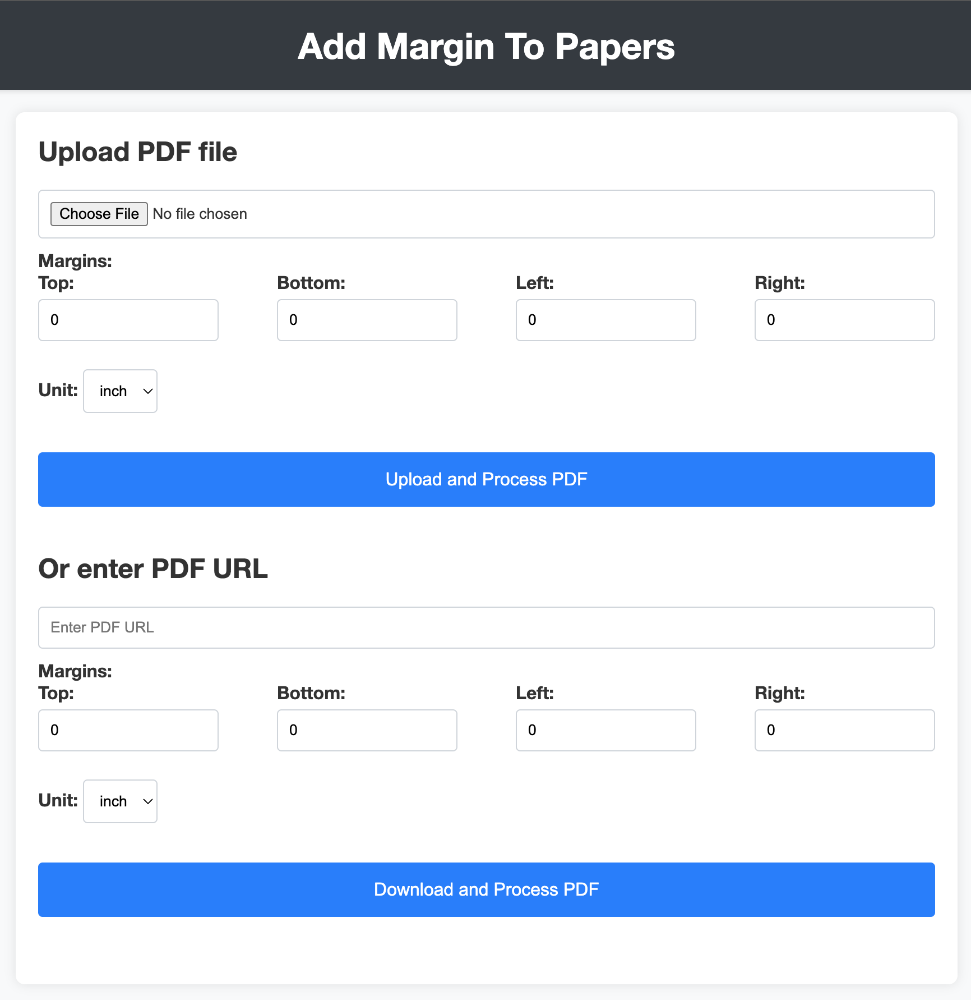
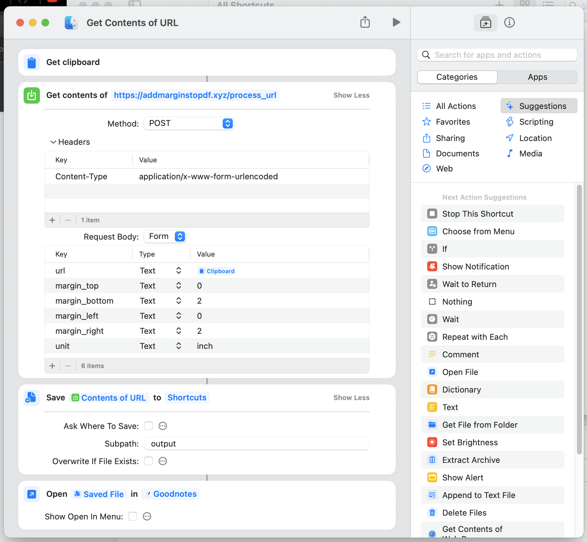

# Introduction

Recently, I signed up for a learning platform offered by my company. There were quite a variety of courses, and among them, the one that caught my eye was the course on utilizing ChatGPT and Copilot.

I've been using `ChatGPT` for work and personal projects since last year, but I've never seriously considered Prompt Engineering like others, and because Copilot was paid, I only used a free VS code extension called `Codi`.

There's a saying that 90% of the time should be spent sharpening the axe if you want to cut a tree, and I felt like I didn't know how to use the best AI tools of the present age, so I skimmed through it on my way to and from work.

It teaches how to utilize ChatGPT and Copilot in development, and `Copilot`, in particular, seemed to be well-integrated with VS code, so I decided to learn it properly and even paid for it.

While learning, I decided to fully utilize it and pondered about what project to do, and ended up doing the following project.

# Project: Add margins to PDF

I learned that Copilot can really help with things that people often use but find confusing. So, I thought about applying it to automate tasks that I often do.

When I read a paper in detail, I import it into GoodNote and take notes while reading, and I often highlight the paper and summarize paragraphs in the corner of the paper or write down parts that are hard to understand. But because most papers don't have wide margins, it's uncomfortable to write small, so I thought about increasing the margins. Download the PDF file of the paper you want to look at in detail, and upload it to a website that changes the margins of the PDF for free. After that, choose the margin as much as you want and proceed, and you can download the PDF with the added margin. Import this modified PDF back into GoodNote and start reading the paper.

These series of processes take a lot of handwork, and the PDF website is slow, so it takes a lot of time. So, I wondered if this process could be automated, and first asked ChatGPT if it was possible to do such work with `Shortcuts` provided by Apple.

Although it seemed possible, there was a limitation that the software that can modify the PDF should support the `Shortcuts`. I decided to put aside the idea of full automation for now, and decided to find out if I could modify the PDF using the python library.

# Python coding with Copilot

What I learned from watching the video lecture is that the biggest advantage of Copilot is its seamless integration with VS code, which allows you to select a specific code and ask questions, and it also reads my codebase (Copilot calls it workspace) and can answer based on that.

I avoided using ChatGPT on purpose and communicated as much as possible with Copilot, and proceeded by asking what I needed inline.

For reference, I started without knowing any Python library related to PDF.

As shown in the lecture, I created files and interfaced with Copilot through comments, and also asked IN-LINE through CMD +I. Using comments for ghost coding (automatically filling in the required code when you press tab) kept repeating the same comments and code, so I stopped and started asking in the chat window.

I simply asked for a Python code that could add margins to the bottom and right of the PDF, and they wrote it out quickly. For some reason, I had a suspicion that the code might not run, so I had a sense of burden that I should understand the code to some extent and then copy and paste it.

But if I do that, productivity will drop ridiculously, and the meaning of using Copilot will fade. So, as the lecturer did, I completely trusted Copilot and copied and pasted the code.

When I copied and pasted, I first got a code that works without error. But one problem is that the size of the PDF increased by adding margins, but the content of the PDF did not move, so contrary to my intention to add margins to the bottom and right, margins were automatically added to the top and right.

Upon closer inspection, I used a function called translate that moves the content of the PDF, but for some reason it was not working. Because I decided to rely entirely on Copilot, I didn't open and read the library documentation, but it seemed that the problem was that the moving part was not applied when creating and moving the pdf document.

I explained the situation to Copilot and asked for it to be fixed. However, despite my 2-3 repeat requests, they kept giving me similar codes. I tried using "@workplace" or "@terminal" that I saw in the lecture, but other than the benefit of not having to copy and paste, there didn't seem to be a big change in the quality of the answers.

I changed the strategy and asked to implement it using a different library that deals with PDFs, and it seemed to work to some extent, but the problem was that I once changed the content of the PDF to an image and then made it back to PDF, so the text was damaged, and I gave up.

I decided to stop using Copilot anymore, and decided to rely on the power of the original ChatGPT.

# ChatGPT

First, I did not use the code that Copliot originally wrote, and just verbally told them the requirements. Then, using the same library as the original code that Copliot first gave, a similar code was generated.

Showing them the code written by Copliot and asking them to fix only the necessary functions (functions including 'translate'), they gave me the code that works exactly.

Finally, using ChatGPT, I completed the remaining code and asked about integration with Apple Shortcuts, so I completed the code.

# Final code and results

- Code Repo: [https://github.com/qelloman/add-margin-to-paper](https://github.com/qelloman/add-margin-to-paper)
- Website for using the API: [https://www.addmarginstopdf.xyz/](https://www.addmarginstopdf.xyz/)
- The screen when using the website directly
    
    
    

When the above shortcut is executed, it downloads a pdf using the arxiv paper address copied to the clipboard via the REST API, adds as much margin as you want to that pdf, and then imports it into goodnote.

# Conclusion

- I tried to implement a feature I need (adding margins to a PDF) in a short time using Copliot and ChatGPT.
- Microsoft Copilot provides a seamless AI environment where users don't have to move back and forth between other UIs using a mouse.
- However, for some reason, it gave me a lower level of results than ChatGPT4o, so I ended up using ChatGPT.
- Still, the experience of developing just by pressing the tab was truly a new world.
