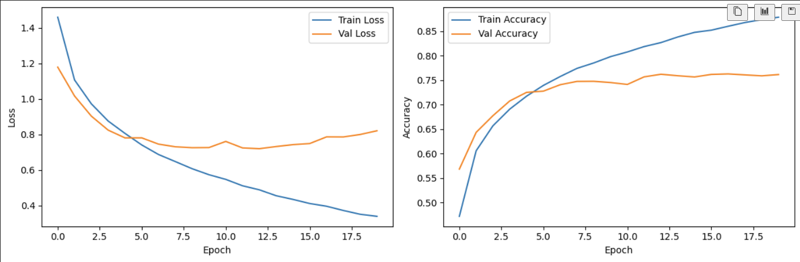
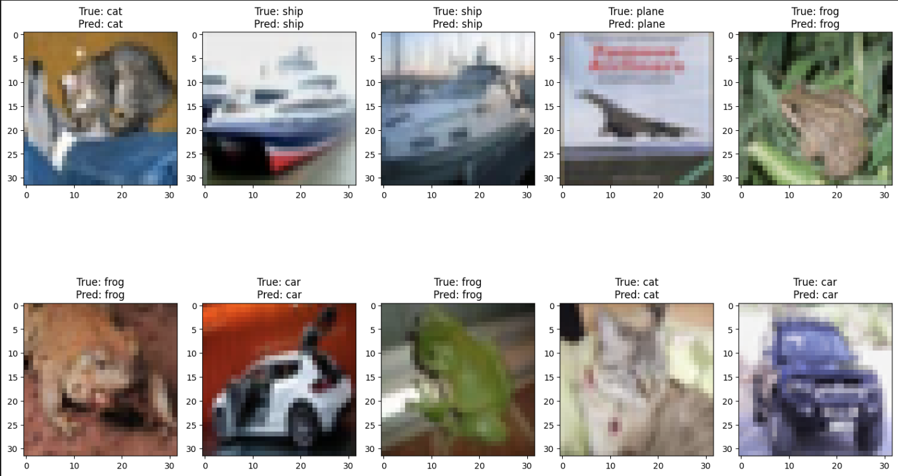

***Do you know how to concat two tensors in pytorch?***

***Do you know how to get the maximum element of 2D-tensor with respect to column dimension?***


One day, I realized that I am relying on web search or AI service like chatGTP. What if somebody asks me to write AI code? Can I write it by myself?

So I asked Claude to generate a AI problem to solve and I found that solving the problem was very helpful for me because it reminds me of useful functions and their usages.

I'd like to share the boiler plate code below that I used to solve the problem Claude asked.

# Problem

Convolutional Neural Network (CNN): Implement and train a simple CNN using the CIFAR-10 dataset.

### 1. Data Preparation:
- Use torchvision to download and load the CIFAR-10 dataset.
- Split the data into training (80%) and validation (20%) sets.
- Apply data normalization and augmentation (use RandomHorizontalFlip).
- Create DataLoaders for both training and validation sets with a batch size of 64.

### 2. CNN Model Implementation: Implement a CNN with the following architecture:

- Convolutional layer 1: 3 input channels, 32 filters of size 3x3, ReLU activation
- Max pooling layer: 2x2 size
- Convolutional layer 2: 32 input channels, 64 filters of size 3x3, ReLU activation
- Max pooling layer: 2x2 size
- Fully connected layer 1: 1600 input neurons, 512 output neurons, ReLU activation
- Dropout layer: 50% dropout rate
- Fully connected layer 2: 512 input neurons, 10 output neurons (CIFAR-10 classes)

### 3. Training Setup:

- Loss function: CrossEntropyLoss
- Optimizer: Adam (learning rate: 0.001)
- Number of epochs: 20

### 4. Training Loop Implementation:

- For each epoch, train on the training data and evaluate on the validation data.
- Print training loss, training accuracy, validation loss, and validation accuracy for each epoch.
- Save the model with the best validation accuracy.

### 5. Model Evaluation:

- Evaluate the final model's performance on the test dataset.
- Calculate and report overall accuracy.

### 6. Results Visualization:

- Plot training and validation loss curves.
- Plot training and validation accuracy curves.
- Randomly select and display 10 images from the test set along with their true labels and model predictions.


# Solutions


## Library Import

``` python
# import libraries

# common part
import numpy as np
import torch
import torch.nn as nn

# data prep part
import torchvision
import torchvision.transforms as transforms
from torch.utils.data import DataLoader, random_split

# visualization part
import matplotlib.pyplot as plt
```

To be honest, I do not use vision model often so that torchvision is not really familiar to me. 

## Data Prep

``` python
# transform functions
train_transforms = transforms.Compose([
    transforms.ToTensor(),
    transforms.RandomHorizontalFlip(0.5),
    transforms.Normalize((0.5,0.5,0.5), (0.5, 0.5,0.5))
])

test_transforms = transforms.Compose([
    transforms.ToTensor(),
    transforms.Normalize((0.5,0.5,0.5), (0.5, 0.5,0.5))
])

# get CIFAR10 dataset
train_dataset = torchvision.datasets.CIFAR10(root='./data/', train=True, download=True, transform=train_transforms)
test_dataset = torchvision.datasets.CIFAR10(root='./data/', train=False, download=True, transform=test_transforms)

train_size = int(0.8 * len(dataset))
val_size = len(dataset) - train_size
train_dataset, val_dataset = random_split(dataset, [train_size, val_size]) # use random_split to keep transform function.

# build data loaders
batch_size = 64
train_loader = DataLoader(train_dataset, batch_size=batch_size, shuffle=True)
val_loader = DataLoader(val_dataset, batch_size=batch_size, shuffle=False)
test_loader = DataLoader(test_dataset, batch_size=batch_size, shuffle=False)
```
Basically, I download `CIFAR10` data from the web. By the `train` argument, it will be either train dataset or test dataset. The `transform` argument part is funny part. We build a transform function which is made of a series of functions. (Think of `Compose` as nn.Sequential!) However, the functions are not called when we build the datasets. The functions are called when we use a data loader which has the dataset.


In the beginning, I thought the `RandomHorizontalFlip` must be excuted in advance to increase the number of training data. However, the data loader will dynamically apply the function when we are training. Note that the `RandomHorizontalFlip` only applies to the training dataset.

`ToTensor` converts PIL or ndarray into tensor. While converting, it reduce the value range from [0,255] to [0, 1.0]. This is why we can normalize with 0.5 means and 0.5 standard deviation. We might use `StandardScaler` to be more thorough, but rough scaling still works well.

To keep many attributes in the dataset such as trasnform functions, we need to use `random_split` from `torch` library instead of `train_test_split` from `scikit-learn`. `train_test_split` will return lists, not datasets.

> Actually, val_loader should not use `RandomHorizontalFlip`. For simplicity, I just keep this way. In order to use the function only for the training dataset, then we need to use CustomDataset.


## CNN Model
``` python
class VisionModel(nn.Module):
    def __init__(self):
        super(VisionModel, self).__init__()
        self.net_2d = nn.Sequential(
            nn.Conv2d(in_channels=3, out_channels=32, kernel_size=3, padding=1), # 32 * 32 * 32
            nn.ReLU(),
            nn.MaxPool2d(2), # 32 * 16 * 16
            nn.Conv2d(in_channels=32, out_channels=64, kernel_size=3, padding=1), # 64 * 16 * 16
            nn.ReLU(),
            nn.MaxPool2d(2), # 64 * 8 * 8
        )
        self.net_mlp = nn.Sequential(
            nn.Linear(64*8*8, 512),
            nn.ReLU(),
            nn.Dropout(0.5),
            nn.Linear(512,10)
        )
    
    def forward(self, x):
        out_2d = self.net_2d(x)
        out_2d = out_2d.view(-1, 64*8*8)
        out = self.net_mlp(out_2d)
        return out
```


As instructed, the model is made of 2D convolution layers and MLP layers. After 2D layers, we need to flatten the intermediate data to feed into MLP.

The final output dimension is 10 since each output indicates the probability of whether the object is in the class.

Note that padding is applied to keep the dimension. `padding=1` means padding is added to each side (top, bottom, left and right).


## Training Prep

``` python
from torch.optim import Adam
from torch.nn import CrossEntropyLoss

model = VisionModel()
device = torch.device('cuda') if torch.cuda.is_available() else torch.device('cpu')
model.to(device)
optim = Adam(model.parameters(), lr=1e-3)
num_epoch = 20
criterion = CrossEntropyLoss()
```

I instantiated my `VisionModel` and loaded it on GPU. As instructed, I used `Adam` optimizer and `CrossEntropyLoss`.

Note that `CrossEntropyLoss` can takes different size of two tensors. For example, my model output has 10 dim. However, the label from torchvision dataset has 1 dim and integer which indicates the class. Without one-hot encoding, `CrossEntropyLoss` can automatically process these different formats.


## Training and validation Iteration
``` python
train_losses, train_accs = [], []
val_losses, val_accs = [], []

best_val_acc = 0.0

for epoch in range(num_epoch):
    model.train()
    train_loss = 0.0
    train_correct = 0
    for x, y_true in train_loader:
        y_pred = model(x.to(device))
        y_true = y_true.to(device)
        loss = criterion(y_pred, y_true)

        optim.zero_grad()
        loss.backward()
        optim.step()

        train_loss += loss.item()
        _, prediction = y_pred.max(1) # torch.max returns 2 items. Check which class has the highest probability.
        train_correct += prediction.eq(y_true).sum().item() # compare with the integer label.

    train_loss /= len(train_loader)
    train_acc = train_correct / len(train_dataset)
    train_losses.append(train_loss)
    train_accs.append(train_acc)

    model.eval()
    with torch.no_grad():
        val_loss = 0.0
        val_correct = 0
        for x, y_true in val_loader:
            y_pred = model(x.to(device))
            y_true = y_true.to(device)

            loss = criterion(y_pred, y_true)

            val_loss += loss.item()
            _, prediction = y_pred.max(1)
            val_correct += prediction.eq(y_true).sum().item()

        val_loss /= len(val_loader)
        val_acc = val_correct / len(val_dataset)
        val_losses.append(val_loss)
        val_accs.append(val_acc)

    print(f"Epoch {epoch+1}/{num_epoch}:")
    print(f"Train Loss: {train_loss:.4f}, Train Accuracy: {train_acc:.4f}")
    print(f"Val Loss: {val_loss:.4f}, Val Accuracy: {val_acc:.4f}")

    if val_acc > best_val_acc: # save the model whenever the best validation score happened.
        best_val_acc = val_acc
        torch.save(model.state_dict(), 'best_model.pth')

```


## Test trained model

``` python
test_model = VisionModel().to(device)
test_model.load_state_dict(torch.load('best_model.pth'))
test_correct = 0
all_preds = []
all_labels = []

with torch.no_grad():
    for x, y_true in test_loader:
        x, y_true = x.to(device), y_true.to(device)
        y_pred = test_model(x)
        _, prediction = y_pred.max(1)
        test_correct += prediction.eq(y_true).sum().item()
        all_preds.extend(prediction.cpu().numpy())
        all_labels.extend(y_true.cpu().numpy())

test_accuracy = test_correct / len(test_dataset)
print(f"Test Accuracy: {test_accuracy:.4f}")

```

I only chcekd the accuracy and it is 0.73 which seems high enough to me.


## Visualization

``` python
import matplotlib.pyplot as plt
plt.figure(figsize=(12, 4))
plt.subplot(1, 2, 1)
plt.plot(train_losses, label='Train Loss')
plt.plot(val_losses, label='Val Loss')
plt.xlabel('Epoch')
plt.ylabel('Loss')
plt.legend()

plt.subplot(1, 2, 2)
plt.plot(train_accs, label='Train Accuracy')
plt.plot(val_accs, label='Val Accuracy')
plt.xlabel('Epoch')
plt.ylabel('Accuracy')
plt.legend()

plt.tight_layout()
plt.show()

classes = ('plane', 'car', 'bird', 'cat', 'deer', 'dog', 'frog', 'horse', 'ship', 'truck')

def imshow(img):
    img = img / 2 + 0.5  # unnormalize
    npimg = img.numpy()
    plt.imshow(np.transpose(npimg, (1, 2, 0)))

dataiter = iter(test_loader)
images, labels = next(dataiter)

model.eval()
outputs = model(images[:10].to(device))
_, predicted = torch.max(outputs, 1)

plt.figure(figsize=(15, 10))
for i in range(10):
    plt.subplot(2, 5, i+1)
    imshow(images[i])
    plt.title(f'True: {classes[labels[i]]}\nPred: {classes[predicted[i]]}')
plt.tight_layout()
plt.show()

```
Below images are the results of visualizatoin.
Overfitting happens within 10 epochs but I got quite accurate classifier model, confirmed by test images.





# Conclusion

Even though this code looks really simple and tutorial-like but when it comes to hands-on coding then you will be surprised how much you don't know the function. This was a really good opportunity for me to check out many documentations and learn accurage usage.

